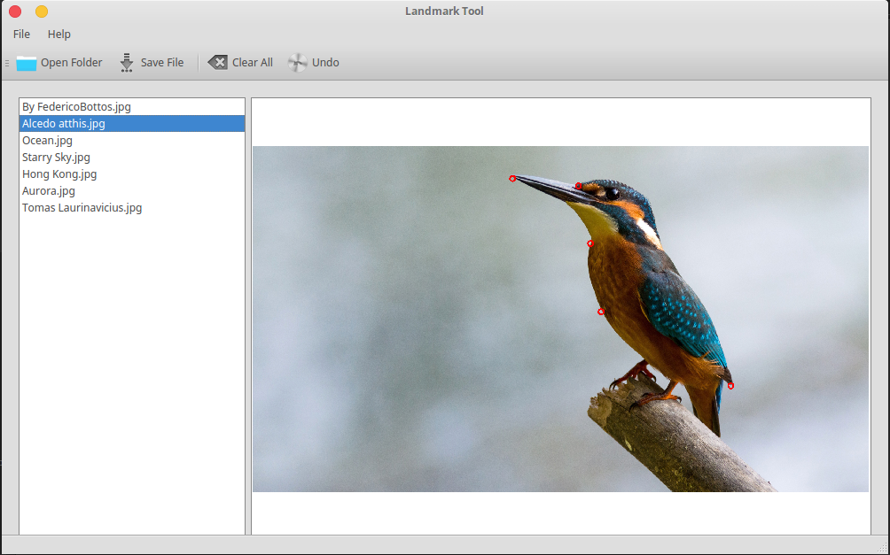

# landmark-tool
Landmark Tool is a simple application that helps you to landmark images

## Screenshots



## Install

### For Ubuntu (based) distro

Download latest deb package from release page, then cd to the location of the downloaded package, run the following command

```sh
sudo dpkg -i landmark*
sudo apt -f install
```

After installed, search "landmark-tool" in your system launch center, or    
Run `landmark-tool` from your terminal.

### For other platform

Setup the develop environment for `python2.7` and  `python-qt4`, then pull this repository, cd to '/src' and run the following command

```sh
python landmark.py
```

## How to

* Click "Open Folder" to choose your dataset
* Pick up an image from the list
* Left click on the selected image to make landmark
* Click "Save File" to save the landmarks to json file

All the landmarks will be first stored in a python dictionary, and then dump to a json file which should be located at the root of your provided folder(dataset), named as "landmark.json"

## LICENSE

MIT License

Copyright (c) 2017 ydchen@yahoo.com

Permission is hereby granted, free of charge, to any person obtaining a copy
of this software and associated documentation files (the "Software"), to deal
in the Software without restriction, including without limitation the rights
to use, copy, modify, merge, publish, distribute, sublicense, and/or sell
copies of the Software, and to permit persons to whom the Software is
furnished to do so, subject to the following conditions:

The above copyright notice and this permission notice shall be included in all
copies or substantial portions of the Software.

THE SOFTWARE IS PROVIDED "AS IS", WITHOUT WARRANTY OF ANY KIND, EXPRESS OR
IMPLIED, INCLUDING BUT NOT LIMITED TO THE WARRANTIES OF MERCHANTABILITY,
FITNESS FOR A PARTICULAR PURPOSE AND NONINFRINGEMENT. IN NO EVENT SHALL THE
AUTHORS OR COPYRIGHT HOLDERS BE LIABLE FOR ANY CLAIM, DAMAGES OR OTHER
LIABILITY, WHETHER IN AN ACTION OF CONTRACT, TORT OR OTHERWISE, ARISING FROM,
OUT OF OR IN CONNECTION WITH THE SOFTWARE OR THE USE OR OTHER DEALINGS IN THE
SOFTWARE.
